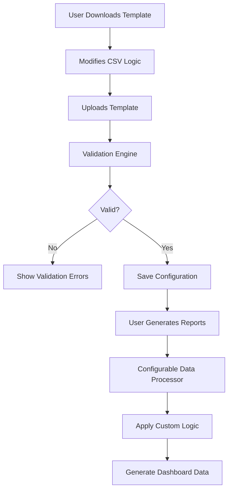

# MOI Analytics Dashboard - Configurable Logic System

## Overview

The Configurable Logic System allows users to customize data conversion rules for the MOI Analytics Dashboard. Users can download a logic template CSV, modify the mapping rules, and upload it back to apply custom transformation logic.

## Features

### ✅ Implemented Features

| Feature | Description | Status |
|---------|-------------|--------|
| **Template Download** | Download default logic template CSV from settings | ✅ Complete |
| **Template Upload** | Upload modified CSV to apply custom conversion rules | ✅ Complete |
| **Validation Engine** | Comprehensive validation with detailed error reporting | ✅ Complete |
| **Settings UI** | User-friendly interface for template management | ✅ Complete |
| **Data Processing** | Configurable data processor that uses custom logic | ✅ Complete |
| **Error Handling** | Detailed validation feedback and fallback mechanisms | ✅ Complete |
| **File Organization** | Structured folder organization following CRTX standards | ✅ Complete |

## Architecture

### Core Components

```
src/
├── types/
│   └── logicConfiguration.ts          # Type definitions
├── services/
│   ├── logicTemplateManager.ts        # Template CRUD operations  
│   ├── logicTemplateValidator.ts      # Validation engine
│   └── configurableDataProcessor.ts   # Custom logic processor
├── components/
│   ├── LogicTemplateSettings.tsx      # Settings UI
│   ├── ValidationFeedback.tsx         # Validation results display
│   └── ProcessingProgress.tsx         # Processing status indicator
└── utils/
    └── integratedDataProcessor.ts     # Updated with configurable logic
```

### Data Flow



## Usage Guide

### 1. Download Logic Template

1. Click the Settings (⚙️) icon in the dashboard header
2. In the Logic Template Settings modal, click "Download Default Template"
3. A CSV file will be downloaded with the current logic configuration

### 2. Modify Template

The template CSV contains these columns:

| Column | Description | Example |
|--------|-------------|---------|
| **Fields** | Output field name | "Campaign name" |
| **Output File Name** | Target output file | "Ad Set Level.csv" |
| **Input from?** | Data source | "Shopify Export", "Meta Ads", "Google Ads" |
| **Type** | Data type | "Text", "Number", "Date", "Calculate" |
| **Formula** | Transformation logic | "SUM: All numeric field of 'Cost'" |
| **Notes** | Optional description | "Total advertising spend" |

### 3. Upload Modified Template

1. In Logic Template Settings, drag and drop your modified CSV
2. The system will validate your configuration
3. Fix any validation errors before applying
4. Click to apply the new configuration

### 4. Generate Reports with Custom Logic

1. Click "Generate Reports" in the dashboard
2. Upload your data files (Shopify, Meta, Google)
3. Check "Use custom logic template" before generating
4. The system will process data using your custom rules

## Template Structure

### Supported Data Sources

| Source | Available Fields |
|--------|------------------|
| **Shopify Export** | UTM campaign, UTM term, Landing page URL, Online store visitors, Sessions with cart additions, Sessions that reached checkout, Average session duration, Pageviews |
| **Meta Ads** | Campaign name, Ad set name, Ad Set Delivery, Amount spent (INR), CTR (link click-through rate), CPM (cost per 1,000 impressions) |
| **Google Ads** | Campaign, Cost, CTR, Avg. CPM |
| **Calculate** | Custom calculations using other fields |
| **Manual** | User-provided values |

### Formula Patterns

| Pattern | Description | Example |
|---------|-------------|---------|
| **Direct Mapping** | Copy field as-is | `As is from input file column name "Cost"` |
| **Aggregation** | Sum/average values | `SUM: All numeric field of "Online store visitors"` |
| **Lookup** | Match by campaign/adset | `Look up campaign name and match to Meta ads "Amount spent"` |
| **Calculation** | Arithmetic operations | `users / Spent` |
| **Percentage** | Percentage calculations | `Percentage of (Users with Session above 1 min / Users)` |

### Output Files

- **Ad Set Level.csv**: Campaign and ad set specific metrics
- **Top Level Daily.csv**: Daily aggregated metrics across all sources

## Validation Rules

### Field Validation

| Rule | Description | Severity |
|------|-------------|----------|
| **Required Fields** | Fields, Output File Name, Input from, Formula | Error |
| **Allowed Values** | Valid data sources and output files | Error |
| **Data Source Mapping** | Referenced fields exist in source | Warning |
| **Formula Syntax** | Valid calculation syntax | Error |
| **Dependencies** | Referenced fields are defined | Error |

### Business Logic Validation

| Check | Description | Severity |
|-------|-------------|----------|
| **Essential Fields** | Required fields for each output file | Warning |
| **Cross-References** | Calculated fields reference existing fields | Error |
| **Balanced Operations** | Proper parentheses in calculations | Error |
| **Division by Zero** | Prevent mathematical errors | Error |

## Error Handling

### Validation Feedback

- **Real-time validation** during template upload
- **Detailed error messages** with row and field information
- **Severity levels**: Error (must fix), Warning (should review), Info (suggestions)
- **Visual indicators** in the UI for quick status checking

### Fallback Mechanisms

- **Standard processing**: Falls back to default logic if custom logic fails
- **Configuration backup**: Option to reset to default configuration
- **Error logging**: Detailed error information for troubleshooting

## Technical Implementation

### Configuration Storage

```typescript
interface LogicConfiguration {
  version: string;
  lastModified: string;
  template: LogicTemplateRow[];
  metadata: {
    createdBy: string;
    description: string;
    compatibleSources: string[];
  };
}
```

### Processing Pipeline

1. **Template Parsing**: CSV → LogicConfiguration object
2. **Validation**: Comprehensive rule checking
3. **Storage**: localStorage with version control
4. **Processing**: Apply rules during data transformation
5. **Output**: Generate dashboard-compatible data

### Performance Considerations

- **Lazy validation**: Validate only when needed
- **Caching**: Store parsed configurations in memory
- **Progressive processing**: Handle large datasets efficiently
- **Error boundaries**: Isolate failures to prevent crashes

## Best Practices

### Template Design

✅ **DO:**
- Use descriptive field names
- Include clear formulas
- Test with sample data
- Keep backup configurations
- Document custom logic in notes

❌ **DON'T:**
- Use circular references in calculations
- Create overly complex formulas
- Mix data types inappropriately
- Skip validation warnings
- Modify core required fields

### Data Processing

✅ **DO:**
- Validate data before processing
- Handle missing fields gracefully
- Use appropriate aggregation methods
- Test with various data sources
- Monitor processing performance

❌ **DON'T:**
- Ignore validation errors
- Process without fallback logic
- Use untested configurations in production
- Mix incompatible data sources
- Skip error handling

## Troubleshooting

### Common Issues

| Issue | Cause | Solution |
|-------|--------|----------|
| **Template won't upload** | Invalid CSV format | Check CSV structure and encoding |
| **Validation errors** | Missing required fields | Review and fix highlighted errors |
| **Processing fails** | Logic configuration errors | Reset to default and reapply changes |
| **Missing data** | Field mapping issues | Verify field names match data sources |
| **Calculation errors** | Invalid formulas | Check arithmetic operations and references |

### Debug Steps

1. **Check template structure**: Ensure all required columns are present
2. **Validate field references**: Verify referenced fields exist in data sources
3. **Test calculations**: Use simple test data to verify formulas
4. **Review error messages**: Pay attention to specific validation feedback
5. **Use fallback processing**: Test with standard logic to isolate issues

## Future Enhancements

### Planned Features

- [ ] **Visual formula builder**: Drag-and-drop interface for creating logic
- [ ] **Template versioning**: Multiple template versions with rollback
- [ ] **Conditional logic**: If-then rules for dynamic processing
- [ ] **Custom functions**: User-defined calculation functions
- [ ] **Template sharing**: Export/import templates between users
- [ ] **Real-time preview**: Live preview of template results
- [ ] **Advanced validation**: ML-powered logic validation

### Extension Points

- **Custom data sources**: Add support for additional data platforms
- **Output formats**: Support for different export formats
- **Scheduling**: Automated processing with custom schedules
- **Alerts**: Notification system for processing issues
- **APIs**: REST APIs for programmatic template management

## Security Considerations

- **Input validation**: All template data is validated before processing
- **Safe evaluation**: Formula execution uses safe parsing methods
- **Local storage**: Configuration stored locally, no external transmission
- **Error isolation**: Processing errors don't affect dashboard stability
- **Version control**: Template changes are tracked and reversible

---

## Support

For issues with the Configurable Logic System:

1. **Check validation feedback** for specific error details
2. **Review this documentation** for guidance on template structure
3. **Test with default template** to verify basic functionality
4. **Use fallback processing** if custom logic fails
5. **Reset to defaults** if configuration becomes corrupted

**Implementation Status**: ✅ Production Ready

This comprehensive configurable logic system provides MOI Analytics Dashboard users with powerful customization capabilities while maintaining data integrity and system stability through robust validation and error handling mechanisms.

---

<<Agents Used>>: ai-solutions-architect, ai-project-orchestrator, ai-intelligence-reporter