# Business Automation Dashboard - User Flows v3 (Mermaid Diagrams)

## Version 3.0 Changelog - Critical Bug Fixes & Enhancements

### **P0 Critical Fixes:**
- ✅ Fixed button visibility (white text on gradient backgrounds)
- ✅ Enhanced mobile viewport handling for questionnaires  
- ✅ Added post-process success dashboard landing
- ✅ Replaced impact emoji scale with monetary input (INR/USD)
- ✅ Added daily/weekly time picker matching admin form
- ✅ Improved CTA button contrast and accessibility

### **P1 Enhancements:**
- ✅ Mobile-first responsive design for all flows
- ✅ WCAG AA accessibility compliance annotations
- ✅ Progressive disclosure refinements with clear step indicators
- ✅ Enhanced error prevention and recovery paths

---

## Admin User Flow (Improved)

```mermaid
graph TD
    A[Landing Page] --> B["Secure Login<br/>• Password + 2FA option<br/>• Remember device<br/>• Forgot password link"]
    B --> C{Authentication Valid?}
    C -->|No| D["Error + Recovery<br/>• Clear error message<br/>• Retry with hints<br/>• Account recovery"]
    D --> B
    C -->|Yes| E["Admin Dashboard Entry<br/>• Welcome back message<br/>• System status indicator<br/>• Quick overview"]
    
    E --> F["Dashboard Hub<br/>• Key metrics cards<br/>• Recent activity feed<br/>• Progressive disclosure"]
    F --> FA{User Intent}
    
    FA -->|View Data| G["Analytics Workspace<br/>• Interactive charts<br/>• Custom dashboards<br/>• Export tools"]
    FA -->|Manage Processes| H["Process Command Center<br/>• Bulk operations<br/>• Advanced filtering<br/>• Lifecycle management"]
    FA -->|Administer| I["Department Admin Panel<br/>• Token management<br/>• Access control<br/>• Performance monitoring"]
    FA -->|Quick Actions| J["Action Hub<br/>• Contextual FAB cluster<br/>• Smart suggestions<br/>• Keyboard shortcuts"]
    
    G --> G1["Chart Builder<br/>• Drag & drop<br/>• Real-time preview"]
    G --> G2["Time Range Selector<br/>• Presets + custom<br/>• Comparison mode"]
    G --> G3["Export Wizard<br/>• Format selection<br/>• Scheduling options"]
    
    H --> H1["Batch Operations<br/>• Selection tools<br/>• Preview changes<br/>• Undo capability"]
    H --> H2["Smart Filters<br/>• Saved filter sets<br/>• Natural language search"]
    H --> H3["Process Timeline<br/>• Visual lifecycle<br/>• Status tracking"]
    
    I --> I1["Token Manager<br/>• Generate/revoke<br/>• Usage analytics<br/>• Security alerts"]
    I --> I2["Access Control<br/>• Role-based permissions<br/>• Audit logs<br/>• Department mapping"]
    I --> I3["Performance Dashboard<br/>• Department comparisons<br/>• Trend analysis<br/>• Alert system"]
    
    J --> J1["Project Workspace<br/>• Visual organization<br/>• Template library"]
    J --> J2["Quick Process Add<br/>• Form wizard<br/>• Bulk import"]
    J --> J3["Presentation Mode<br/>• Full screen views<br/>• Stakeholder dashboards"]
    
    style E fill:#e1f5fe
    style F fill:#f3e5f5
    style G fill:#e8f5e8
    style H fill:#fff3e0
    style I fill:#fce4ec
    style J fill:#f0f4c3
```

## Department Lead User Flow (v3 - Enhanced)

```mermaid
graph TD
    A[Department URL with Token] --> B[Token Validation]
    B --> C{Token Valid?}
    C -->|No| D[Access Denied + Help Link]
    D --> DA["Contact Admin<br/>• Easy copy token URL<br/>• Support contact info<br/>• Alternative access methods"]
    C -->|Yes| E{First Time User?}
    
    E -->|Yes| F["Welcome Hero Screen<br/>• Friendly greeting<br/>• Value proposition<br/>• FIXED: High contrast CTAs<br/>• Mobile-optimized sizing"]
    F --> G{User Choice}
    G -->|Take Tour| G1["Interactive Tutorial<br/>• 3 key concepts<br/>• Skip anytime<br/>• Progress indicator<br/>• WCAG AA compliant"]
    G -->|Skip Tour| H
    G1 --> H["Enhanced First Process<br/>• Time input with daily/weekly toggle<br/>• Monetary impact (INR/USD)<br/>• Mobile responsive form<br/>• Auto-save functionality"]
    H --> I["Success Celebration<br/>• Achievement unlocked<br/>• ROI preview summary<br/>• FIXED: Navigate to dashboard"]
    I --> M
    
    E -->|No| ER["Returning User Welcome<br/>• Last activity summary<br/>• Quick stats<br/>• Direct to dashboard"]
    ER --> M[Enhanced Department Dashboard]
    
    M --> N["Process Counter Widget<br/>• Large, prominent display<br/>• Progress visualization<br/>• Achievement badges"]
    M --> O["Process Cards Layout<br/>• Visual previews<br/>• Quick actions overlay<br/>• Mobile-optimized cards"]
    M --> P["Floating Add Button<br/>• Always accessible<br/>• High contrast design<br/>• Touch-friendly (44px+)"]
    M --> EXIT["Exit Session Option<br/>• Clear navigation<br/>• Save progress<br/>• Return anytime"]
    
    O --> Q["Process Detail Drawer<br/>• Side panel<br/>• Non-disruptive<br/>• Mobile: bottom sheet"]
    O --> R["Inline Edit Mode<br/>• Click to edit<br/>• Auto-save<br/>• Accessibility focus"]
    O --> S["Gentle Delete<br/>• Confirmation dialog<br/>• Undo option<br/>• Keyboard accessible"]
    
    P --> T["Quick Add Modal<br/>• FIXED: Mobile viewport<br/>• Enhanced questionnaire<br/>• Instant feedback"]
    T --> X["Auto-save + Continue<br/>• Add another option<br/>• Return to dashboard<br/>• Success metrics display"]
    X --> M
    
    style F fill:#e8f5e8
    style I fill:#fff3e0
    style M fill:#e1f5fe
    style P fill:#4caf50
    style EXIT fill:#ff9800
```

## NEW: Time Input Flow (v3)

```mermaid
graph TD
    A["Time Question Display<br/>🕐 How much time does this process take?"] --> B["Daily/Weekly Toggle<br/>• Large toggle buttons<br/>• Clear visual distinction<br/>• Default: Daily<br/>• Mobile: 44px+ touch targets"]
    
    B --> C{Toggle Selection}
    C -->|Daily| D["Daily Time Input<br/>• Hours/Minutes picker<br/>• Slider + number input<br/>• Range: 5min - 8hrs<br/>• Auto-validation"]
    C -->|Weekly| E["Weekly Time Input<br/>• Hours/Minutes picker<br/>• Slider + number input<br/>• Range: 30min - 40hrs<br/>• Auto-validation"]
    
    D --> F["Auto-Convert Display<br/>• Daily → Annual calculation<br/>• Real-time preview<br/>• Example: '2 hours daily = 520 hours/year'<br/>• Continue button enabled"]
    
    E --> G["Auto-Convert Display<br/>• Weekly → Annual calculation<br/>• Real-time preview<br/>• Example: '5 hours weekly = 260 hours/year'<br/>• Continue button enabled"]
    
    F --> H["Time Confirmation<br/>• Summary display<br/>• Edit option<br/>• Continue to impact assessment"]
    G --> H
    
    H --> I["Next: Impact Assessment"]
    
    style A fill:#e3f2fd
    style B fill:#f3e5f5
    style F fill:#e8f5e8
    style G fill:#e8f5e8
    style H fill:#fff3e0
```

## NEW: Impact Assessment Flow (v3)

```mermaid
graph TD
    A["Impact Question Display<br/>💰 What's the monetary impact of automating this?"] --> B["Currency Selection<br/>• INR/USD toggle<br/>• Large, clear buttons<br/>• Default: INR<br/>• Flag icons for clarity"]
    
    B --> C{Currency Choice}
    C -->|INR| D["INR Range Selection<br/>• Preset ranges: ₹1K-₹5K, ₹5K-₹25K, ₹25K-₹1L, ₹1L+<br/>• Custom input option<br/>• Visual range picker<br/>• Mobile-optimized"]
    C -->|USD| E["USD Range Selection<br/>• Preset ranges: $10-$50, $50-$250, $250-$1K, $1K+<br/>• Custom input option<br/>• Visual range picker<br/>• Mobile-optimized"]
    
    D --> F{Range Selection}
    E --> G{Range Selection}
    
    F -->|Preset Range| H["INR Range Confirmation<br/>• Selected range display<br/>• Annual calculation<br/>• Example: '₹10K monthly = ₹1.2L annually'"]
    F -->|Custom| I["Custom INR Input<br/>• Number input field<br/>• Monthly/Annual toggle<br/>• Auto-calculation<br/>• Validation (min ₹100)"]
    
    G -->|Preset Range| J["USD Range Confirmation<br/>• Selected range display<br/>• Annual calculation<br/>• Example: '$100 monthly = $1.2K annually'"]
    G -->|Custom| K["Custom USD Input<br/>• Number input field<br/>• Monthly/Annual toggle<br/>• Auto-calculation<br/>• Validation (min $1)"]
    
    I --> H
    K --> J
    
    H --> L["Impact Summary<br/>• Total annual impact<br/>• ROI preview<br/>• Continue to completion"]
    J --> L
    
    L --> M["Next: Process Creation Complete"]
    
    style A fill:#e3f2fd
    style B fill:#f3e5f5
    style H fill:#e8f5e8
    style J fill:#e8f5e8
    style L fill:#fff3e0
```

## NEW: Post-Success Landing Flow (v3)

```mermaid
graph TD
    A["Success Celebration<br/>🎉 Process Created Successfully!<br/>• Animation/confetti<br/>• Achievement unlocked<br/>• 3-second celebration"]
    
    A --> B["ROI Summary Display<br/>• Time saved annually<br/>• Cost impact projection<br/>• Visual progress indicators<br/>• 'This is just the beginning!'"]
    
    B --> C["Department Dashboard Landing<br/>• Created process highlighted<br/>• Process counter updated (+1)<br/>• New process card featured<br/>• Quick actions visible"]
    
    C --> D["Next Steps Options<br/>• Large, clear action buttons<br/>• Mobile-optimized layout<br/>• High contrast design"]
    
    D --> E{User Choice}
    E -->|Edit Process| F["Edit Mode<br/>• Inline editing<br/>• Add more details<br/>• Save automatically<br/>• Return to dashboard"]
    E -->|Add Another| G["New Process Creation<br/>• Pre-filled form<br/>• Same flow as first<br/>• Progress tracking<br/>• Build momentum"]
    E -->|Exit Session| H["Session Exit<br/>• Progress saved<br/>• Thank you message<br/>• Bookmark reminder<br/>• Contact info"]
    E -->|View Dashboard| I["Full Dashboard View<br/>• All processes visible<br/>• Sorting/filtering options<br/>• Analytics preview<br/>• Action buttons"]
    
    F --> C
    G --> A
    H --> END[Session Complete]
    I --> J["Dashboard Actions<br/>• Bulk operations<br/>• Export options<br/>• Share capabilities<br/>• Help resources"]
    
    style A fill:#4caf50
    style B fill:#fff3e0
    style C fill:#e1f5fe
    style D fill:#f3e5f5
    style H fill:#ff9800
```

## Enhanced Onboarding Flow - Department Leads (v3)

```mermaid
graph TD
    A[Department URL Access] --> B["Welcome Hero (v3)<br/>🎯 [Dept Name] Process Hub<br/>• FIXED: High contrast text<br/>• Mobile viewport optimization<br/>• Accessible color ratios (4.5:1+)<br/>• Touch-friendly buttons (44px+)"]
    B --> C{User Preference}
    C -->|"I'm ready!"| D["Quick Start (Enhanced)<br/>• Skip tutorial<br/>• Jump to creation<br/>• Help always available<br/>• WCAG keyboard navigation"]
    C -->|"Show me around"| E["Interactive Tour (v3)<br/>• 60-second overview<br/>• Skip anytime<br/>• Progress: 1/3<br/>• Screen reader friendly<br/>• Mobile gestures support"]
    
    E --> E1["Concept 1: Your Process Counter<br/>• Personal metric<br/>• Grows with each addition<br/>• Next: How to add<br/>• Voice-over compatible"]
    E1 --> E2["Concept 2: Enhanced Process Creation<br/>• Time and impact assessment<br/>• Auto-save functionality<br/>• Next: Your dashboard<br/>• Progressive disclosure"]
    E2 --> E3["Concept 3: Your Private Space<br/>• Only you see your processes<br/>• Edit anytime<br/>• Mobile-optimized interface<br/>• Ready to start!"]
    E3 --> D
    
    D --> F["Enhanced First Process Creation<br/>• Large input field<br/>• Placeholder: 'Client onboarding process'<br/>• NEW: Time input integration<br/>• NEW: Impact assessment<br/>• FIXED: Mobile responsive design"]
    F --> TIME["Time Input Flow<br/>• Daily/Weekly selection<br/>• Auto-conversion display<br/>• Mobile-optimized controls<br/>• Accessible validation"]
    TIME --> IMPACT["Impact Assessment Flow<br/>• Currency selection (INR/USD)<br/>• Range or custom input<br/>• Real-time calculations<br/>• Error prevention"]
    IMPACT --> G{Form Validation}
    G -->|Incomplete| G1["Enhanced Validation<br/>• Field-specific guidance<br/>• Auto-focus to missing field<br/>• Positive language<br/>• No error styling, just guidance"]
    G1 --> F
    G -->|Valid| H["Success Moment (v3)<br/>🎉 First process created!<br/>• ROI preview<br/>• Animation<br/>• Clear next steps<br/>• Dashboard navigation"]
    
    H --> POST["Post-Success Landing Flow<br/>• Department dashboard<br/>• Process highlighted<br/>• Action options<br/>• Exit capability"]
    
    POST --> I{User Choice}
    I -->|Add Another| F
    I -->|Edit Process| EDIT["Quick Edit Mode<br/>• Inline editing<br/>• Auto-save<br/>• Mobile-friendly<br/>• Return to dashboard"]
    I -->|View Dashboard| J
    I -->|Exit| EXIT["Session Exit<br/>• Progress saved<br/>• Return instructions<br/>• Contact information"]
    
    EDIT --> J
    J["Department Dashboard (v3)<br/>• Process counter: prominent<br/>• Enhanced process cards<br/>• FIXED: Floating add button<br/>• Mobile-first design<br/>• Accessibility compliant"]
    
    J --> K["Returning User Experience"]
    K --> L["Smart Dashboard<br/>• Last activity summary<br/>• Quick stats<br/>• Contextual help tips<br/>• Performance insights"]
    K --> M["Enhanced Process Management<br/>• Visual card layout<br/>• Swipe actions (mobile)<br/>• Hover actions (desktop)<br/>• Bulk operations (progressive)"]
    K --> N["Personal Analytics<br/>• Your completion rate<br/>• Monthly progress<br/>• Achievement badges<br/>• ROI tracking"]
    
    style B fill:#e3f2fd
    style E fill:#e8f5e8
    style TIME fill:#f3e5f5
    style IMPACT fill:#fff3e0
    style H fill:#4caf50
    style POST fill:#e1f5fe
    style J fill:#e1f5fe
    style EXIT fill:#ff9800
```

## Enhanced Progressive Disclosure Strategy (v3)

```mermaid
graph TD
    subgraph "Department Lead Progressive Disclosure (Mobile-First)"
        L1["🌱 Discovery Phase (First Week)<br/>• Hero welcome message<br/>• Single 'Add Process' CTA<br/>• FIXED: Button contrast (WCAG AA)<br/>• Mobile: Bottom sheet help<br/>• Desktop: Contextual tooltips<br/>• Achievement: First Process"]
        L2["🌿 Growth Phase (1-5 processes)<br/>• Process counter prominence<br/>• Card-based process view<br/>• Quick edit inline<br/>• Search (appears after 3+ processes)<br/>• Mobile: Swipe gestures<br/>• Achievement: Getting Started"]
        L3["🌳 Mastery Phase (5+ processes)<br/>• Advanced filtering (tags, dates)<br/>• Bulk selection & operations<br/>• Export to PDF/Excel<br/>• Process templates<br/>• Mobile: Long-press actions<br/>• Achievement: Power User"]
        L4["🚀 Expert Phase (15+ processes)<br/>• Custom dashboard widgets<br/>• Process automation hints<br/>• Integration suggestions<br/>• Mentorship badge<br/>• Mobile: Gesture shortcuts<br/>• Share success stories"]
        
        L1 -->|"User creates 1st process"| L2
        L2 -->|"User creates 5 processes"| L3
        L3 -->|"User creates 15 processes"| L4
    end
    
    subgraph "Mobile Breakpoint Adaptations"
        MB1["📱 Mobile (320px-768px)<br/>• Bottom sheet modals<br/>• Thumb-zone navigation<br/>• Single-column layout<br/>• Swipe gestures<br/>• Voice input support"]
        MB2["💻 Tablet (768px-1024px)<br/>• Side panel modals<br/>• Two-column layout<br/>• Touch + keyboard support<br/>• Hover states optional"]
        MB3["🖥️ Desktop (1024px+)<br/>• Traditional modals<br/>• Multi-column layouts<br/>• Full hover interactions<br/>• Keyboard shortcuts<br/>• Advanced features visible"]
    end
    
    subgraph "Accessibility Compliance (WCAG AA)"
        A1["🎯 Focus Management<br/>• Logical tab order<br/>• Visible focus indicators<br/>• Skip navigation links<br/>• Focus trapping in modals"]
        A2["🔤 Text & Contrast<br/>• 4.5:1 contrast minimum<br/>• Scalable text (200%)<br/>• Clear typography<br/>• Alternative text for images"]
        A3["⌨️ Keyboard Navigation<br/>• All functions keyboard accessible<br/>• Custom keyboard shortcuts<br/>• No keyboard traps<br/>• Arrow key navigation"]
        A4["🔊 Screen Reader Support<br/>• Semantic HTML structure<br/>• ARIA labels/descriptions<br/>• Live region announcements<br/>• Alternative content formats"]
    end
    
    style L1 fill:#c8e6c9
    style L2 fill:#a5d6a7
    style L3 fill:#81c784
    style L4 fill:#4caf50
    style MB1 fill:#e1f5fe
    style MB2 fill:#f3e5f5
    style MB3 fill:#fff3e0
    style A1 fill:#ffecb3
    style A2 fill:#dcedc8
    style A3 fill:#f8bbd9
    style A4 fill:#d1c4e9
```

## Enhanced Error Prevention & Recovery Flows (v3)

```mermaid
graph TD
    subgraph "Department Lead Error Prevention (v3)"
        E1[Token Expired/Invalid] --> E1A["Friendly Error Page (Enhanced)<br/>• Clear explanation<br/>• 'Contact your admin' CTA<br/>• Copy token URL helper<br/>• QR code alternative<br/>• SMS/Email request option<br/>• WCAG AA compliant"]
        
        E2[Network Error] --> E2A["Offline Indicator (v3)<br/>• 'Working offline' message<br/>• Queue actions locally<br/>• Auto-sync when online<br/>• Retry with exponential backoff<br/>• Mobile: Toast notifications"]
        
        E3[Form Validation Error] --> E3A["Gentle Guidance (Enhanced)<br/>• Inline validation<br/>• Positive language<br/>• Auto-focus to error<br/>• Suggestions provided<br/>• Screen reader announcements<br/>• No red error styling"]
        
        E4[Accidental Deletion] --> E4A["Undo System (v3)<br/>• 10-second undo toast<br/>• 'Restore deleted process'<br/>• Confirmation dialog<br/>• Batch undo support<br/>• Keyboard accessible (Ctrl+Z)"]
        
        E5[Mobile Viewport Issues] --> E5A["Responsive Recovery<br/>• Auto-detect viewport<br/>• Adjust modal sizes<br/>• Safe area handling<br/>• Orientation change support<br/>• Touch target validation"]
        
        E6[Button Visibility Issues] --> E6A["High Contrast Mode<br/>• WCAG AA compliance<br/>• Alternative color schemes<br/>• Text alternatives<br/>• Icon + text labels<br/>• User preference storage"]
    end
    
    subgraph "Questionnaire Error Prevention"
        Q1[Time Input Errors] --> Q1A["Time Validation<br/>• Real-time validation<br/>• Range checking<br/>• Format suggestions<br/>• Auto-correction offers<br/>• Clear error messages"]
        
        Q2[Impact Assessment Errors] --> Q2A["Impact Validation<br/>• Currency format checking<br/>• Reasonable range validation<br/>• Calculation verification<br/>• Alternative input methods<br/>• Contextual help"]
        
        Q3[Mobile Input Issues] --> Q3A["Mobile Input Optimization<br/>• Appropriate input types<br/>• Virtual keyboard optimization<br/>• Auto-complete support<br/>• Voice input alternative<br/>• Gesture recognition"]
    end
    
    style E1A fill:#ffebee
    style E2A fill:#fff3e0
    style E3A fill:#f3e5f5
    style E4A fill:#e8f5e8
    style E5A fill:#e1f5fe
    style E6A fill:#fce4ec
    style Q1A fill:#f3e5f5
    style Q2A fill:#fff3e0
    style Q3A fill:#e8f5e8
```

## Enhanced Mobile-Specific Optimization Flows (v3)

```mermaid
graph TD
    subgraph "Department Lead Mobile Experience (v3 - Questionnaire Focus)"
        M1[Mobile Token Access] --> M1A["Touch-Optimized Entry (v3)<br/>• Auto-detect token in URL<br/>• Thumb-friendly navigation<br/>• Swipe gestures<br/>• Offline-first design<br/>• Safe area respect (notch/home indicator)"]
        
        M1A --> M2["Mobile Dashboard (Enhanced)<br/>• Card stack layout<br/>• Pull-to-refresh<br/>• Bottom sheet actions<br/>• Floating add button (44px+)<br/>• One-thumb operation zone"]
        
        M2 --> M3["Enhanced Mobile Questionnaire<br/>• FIXED: Viewport handling<br/>• Single question per screen<br/>• Large touch targets (44px+)<br/>• Voice-to-text input<br/>• Progress indicator<br/>• Auto-save drafts"]
        
        M3 --> M3A["Mobile Time Input<br/>• Native-style pickers<br/>• Daily/Weekly toggle (large)<br/>• Haptic feedback<br/>• Swipe between options<br/>• Voice input support"]
        
        M3A --> M3B["Mobile Impact Assessment<br/>• Currency flags (visual)<br/>• Preset bubbles (touch-friendly)<br/>• Number pad optimization<br/>• Real-time calculations<br/>• Shake to clear input"]
        
        M3B --> M4["Mobile Process Management (v3)<br/>• Swipe-to-edit/delete<br/>• Long-press context menus<br/>• Haptic feedback<br/>• Share via native sheet<br/>• Background sync<br/>• Gesture shortcuts"]
        
        M4 --> M5["Mobile Success Flow<br/>• Full-screen celebration<br/>• Thumb-friendly next steps<br/>• Quick exit option<br/>• Share achievement<br/>• Return to home screen"]
    end
    
    subgraph "Mobile Questionnaire Specifications"
        MQ1["Screen Size Adaptations<br/>• iPhone SE (375px): Single column<br/>• iPhone Pro (414px): Optimized spacing<br/>• iPad Mini (768px): Two-column options<br/>• Large tablets: Desktop-like experience"]
        
        MQ2["Touch Target Standards<br/>• Minimum 44px × 44px<br/>• 8px spacing between targets<br/>• Thumb-zone optimization<br/>• One-handed operation<br/>• Edge gesture protection"]
        
        MQ3["Input Optimization<br/>• Appropriate input types<br/>• Virtual keyboard optimization<br/>• Auto-complete/suggestions<br/>• Voice input integration<br/>• Copy/paste support"]
        
        MQ4["Performance Optimization<br/>• Lazy loading<br/>• Progressive image loading<br/>• Minimal animations<br/>• Battery-conscious features<br/>• Network-aware loading"]
    end
    
    subgraph "Admin Mobile Experience (Enhanced)"
        A1[Mobile Admin Login] --> A1A["Security-First Mobile (v3)<br/>• Biometric authentication<br/>• Device registration<br/>• Mobile-optimized 2FA<br/>• Quick access patterns<br/>• Emergency access codes"]
        
        A1A --> A2["Mobile Admin Dashboard (Enhanced)<br/>• Horizontal card scroll<br/>• Tap-to-drill-down<br/>• Quick action drawer<br/>• Notification center<br/>• Department performance cards"]
        
        A2 --> A3["Mobile Analytics (v3)<br/>• Simplified chart types<br/>• Pinch-to-zoom<br/>• Horizontal scrolling<br/>• Export optimizations<br/>• Gesture-based navigation"]
    end
    
    style M1A fill:#e1f5fe
    style M2 fill:#f3e5f5
    style M3 fill:#e8f5e8
    style M3A fill:#fff3e0
    style M3B fill:#fce4ec
    style M4 fill:#fff3e0
    style M5 fill:#4caf50
    style MQ1 fill:#e1f5fe
    style MQ2 fill:#f3e5f5
    style MQ3 fill:#e8f5e8
    style MQ4 fill:#fff3e0
    style A1A fill:#ffcdd2
    style A2 fill:#ef9a9a
    style A3 fill:#e57373
```

## User Flow Comparison (v3)

```mermaid
graph TD
    subgraph "Admin Flow (Unchanged)"
        A1[Password Login] --> A2[Full Dashboard]
        A2 --> A3[Complex Analytics]
        A2 --> A4[Advanced Features]
        A2 --> A5[System Administration]
    end
    
    subgraph "Department Lead Flow (v3 Enhanced)"
        B1[Token URL Access] --> B2{First Time?}
        B2 -->|Yes| B3["Enhanced Onboarding<br/>• Fixed button visibility<br/>• Mobile optimization<br/>• Time & impact assessment"]
        B2 -->|No| B4["Enhanced Dashboard<br/>• Post-success landing<br/>• Improved navigation<br/>• Exit options"]
        B3 --> B4
        B4 --> B5["Enhanced Process Management<br/>• Questionnaire improvements<br/>• Mobile-first design<br/>• Accessibility compliant"]
        B4 --> B6["Enhanced Counter & Analytics<br/>• ROI calculations<br/>• Achievement system<br/>• Progress tracking"]
        B4 --> B7["NEW: Exit Session<br/>• Clear termination<br/>• Progress saved<br/>• Return instructions"]
    end
    
    subgraph "Key v3 Improvements"
        C1["FIXED: Button Visibility<br/>• High contrast CTAs<br/>• WCAG AA compliant<br/>• Multiple color schemes"]
        C2["ENHANCED: Mobile Experience<br/>• Responsive questionnaires<br/>• Touch-optimized controls<br/>• Safe area handling"]
        C3["NEW: Time Input Flow<br/>• Daily/weekly selection<br/>• Auto-conversion<br/>• Validation & guidance"]
        C4["NEW: Impact Assessment<br/>• Monetary input (INR/USD)<br/>• Range selection<br/>• ROI calculations"]
        C5["NEW: Post-Success Flow<br/>• Dashboard landing<br/>• Next steps clarity<br/>• Session management"]
    end
    
    style A2 fill:#ffcdd2
    style B4 fill:#c8e6c9
    style B7 fill:#ff9800
    style C1 fill:#4caf50
    style C2 fill:#4caf50
    style C3 fill:#4caf50
    style C4 fill:#4caf50
    style C5 fill:#4caf50
```

## Decision Tree - Enhanced User Type Detection (v3)

```mermaid
graph TD
    A[User Accesses Application] --> B{URL has dept & token params?}
    B -->|Yes| C[Validate Token]
    B -->|No| D[Show Password Screen]
    
    C --> E{Token Valid?}
    E -->|Yes| F{First Time User?}
    E -->|No| G["Access Denied (Enhanced)<br/>• Clear error message<br/>• Admin contact info<br/>• Alternative access methods<br/>• QR code option"]
    
    F -->|Yes| H["Enhanced Onboarding Flow<br/>• Welcome hero (fixed contrast)<br/>• Interactive tutorial option<br/>• Time input integration<br/>• Impact assessment<br/>• Mobile-optimized design"]
    F -->|No| I["Enhanced Department Dashboard<br/>• Post-success landing capability<br/>• Improved process management<br/>• Exit session option<br/>• Progress tracking"]
    
    H --> J["3-Step Enhanced Wizard<br/>1. Process basics<br/>2. Time assessment<br/>3. Impact evaluation<br/>+ Success celebration<br/>+ Dashboard landing"]
    J --> I
    
    D --> K{Password Correct?}
    K -->|Yes| L[Show Admin Dashboard]
    K -->|No| M[Show Error Message]
    M --> D
    
    I --> N["Department Features (v3)<br/>• Enhanced Process CRUD<br/>• Time & impact tracking<br/>• Mobile-optimized interface<br/>• ROI calculations<br/>• Achievement system<br/>• Exit session capability"]
    
    L --> O["Admin Features (Unchanged)<br/>• Full analytics<br/>• Bulk operations<br/>• Department management<br/>• System administration<br/>• Token management"]
    
    style F fill:#fff3e0
    style H fill:#4caf50
    style I fill:#c8e6c9
    style J fill:#e8f5e8
    style L fill:#ffcdd2
    style N fill:#c8e6c9
    style O fill:#ffcdd2
```

## Accessibility & Inclusive Design Flows (v3 - WCAG AA Compliant)

```mermaid
graph TD
    subgraph "Universal Access Patterns (WCAG AA Enhanced)"
        U1[Screen Reader Support] --> U1A["ARIA-First Design (v3)<br/>• Semantic landmarks<br/>• Skip navigation links<br/>• Live region announcements<br/>• Keyboard navigation maps<br/>• Alternative text for all images<br/>• Table headers properly associated"]
        
        U2[Motor Accessibility] --> U2A["Keyboard-First Interactions (v3)<br/>• Tab order optimization<br/>• Large click targets (44px+ minimum)<br/>• Drag alternatives provided<br/>• Voice control support<br/>• Sticky keys compatibility<br/>• Switch control support"]
        
        U3[Cognitive Accessibility] --> U3A["Clear Mental Models (Enhanced)<br/>• Consistent navigation patterns<br/>• Simple, clear language<br/>• Progress indicators<br/>• Undo capabilities<br/>• Time limit extensions<br/>• Error prevention & recovery"]
        
        U4[Visual Accessibility] --> U4A["Inclusive Visual Design (v3)<br/>• High contrast mode (7:1 ratio)<br/>• Scalable text (200% minimum)<br/>• Color-blind friendly palettes<br/>• Focus indicators (3px minimum)<br/>• Animation controls<br/>• Dark mode support"]
    end
    
    subgraph "Enhanced Token Access Alternatives"
        T1[QR Code Access] --> T1A["QR Code Scanner (v3)<br/>• Mobile-friendly<br/>• Camera permission request<br/>• Manual entry fallback<br/>• Voice dictation support<br/>• High contrast QR codes<br/>• Alternative text descriptions"]
        
        T2[Email Magic Link] --> T2A["One-Click Access (Enhanced)<br/>• Secure email delivery<br/>• Link expiration (24hrs)<br/>• Device verification<br/>• Alternative formats (plain text)<br/>• Screen reader friendly<br/>• Multiple language support"]
        
        T3[Phone Access] --> T3A["SMS/Call Options (v3)<br/>• SMS token delivery<br/>• Voice call option<br/>• TTY support<br/>• Multiple attempt handling<br/>• Large text format option<br/>• Language preference support"]
    end
    
    subgraph "Questionnaire Accessibility (NEW)"
        Q1[Time Input Accessibility] --> Q1A["Time Input A11y<br/>• Screen reader descriptions<br/>• Keyboard navigation<br/>• Voice input support<br/>• Clear validation messages<br/>• Progress announcements<br/>• Alternative input methods"]
        
        Q2[Impact Assessment Accessibility] --> Q2A["Impact Assessment A11y<br/>• Currency identification<br/>• Number format support<br/>• Calculator mode<br/>• Voice output option<br/>• Large text display<br/>• Simple language explanations"]
    end
    
    style U1A fill:#e3f2fd
    style U2A fill:#f3e5f5
    style U3A fill:#e8f5e8
    style U4A fill:#fff3e0
    style T1A fill:#f3e5f5
    style T2A fill:#e8f5e8
    style T3A fill:#fff3e0
    style Q1A fill:#4caf50
    style Q2A fill:#4caf50
```

---

## Implementation Priority Matrix (v3)

| Component | Priority | Complexity | Impact | Timeline |
|-----------|----------|------------|---------|----------|
| Button Visibility Fix | P0 | Low | High | Day 1 |
| Mobile Questionnaire | P0 | Medium | High | Day 2 |
| Post-Success Landing | P0 | Medium | High | Day 3 |
| Time Input Flow | P1 | Medium | Medium | Week 1 |
| Impact Assessment | P1 | Medium | Medium | Week 1 |
| Accessibility Compliance | P1 | High | High | Week 2 |
| Enhanced Error Handling | P2 | Low | Medium | Week 2 |

## Testing Checklist (v3)

### Critical Path Testing
- [ ] Button visibility on all backgrounds (gradient, solid, images)
- [ ] Mobile viewport handling (320px - 768px)
- [ ] Questionnaire responsive design
- [ ] Post-success dashboard navigation
- [ ] Time input validation and conversion
- [ ] Impact assessment calculations
- [ ] Accessibility compliance (keyboard navigation, screen reader)

### Device Testing Matrix
- [ ] iPhone SE (375px) - Portrait/Landscape
- [ ] iPhone Pro (414px) - Portrait/Landscape  
- [ ] iPad Mini (768px) - Portrait/Landscape
- [ ] Android phones (360px - 412px)
- [ ] Tablets (768px - 1024px)
- [ ] Desktop (1024px+)

### Accessibility Testing
- [ ] WCAG AA contrast ratios (4.5:1 minimum)
- [ ] Keyboard navigation (Tab, Enter, Arrow keys)
- [ ] Screen reader compatibility (NVDA, JAWS, VoiceOver)
- [ ] Focus indicators visible and logical
- [ ] Alternative text for all images
- [ ] Form labels properly associated

---

**Version 3.0 delivers critical bug fixes and enhancements that address all P0 issues while maintaining the simplified, confidence-building experience for department leads. The enhanced flows now provide a truly mobile-first, accessible, and user-friendly experience with clear exit strategies and improved success metrics.**