# Business Automation Dashboard - User Flows (Mermaid Diagrams)

## Admin User Flow (Improved)

```mermaid
graph TD
    A[Landing Page] --> B["Secure Login<br/>• Password + 2FA option<br/>• Remember device<br/>• Forgot password link"]
    B --> C{Authentication Valid?}
    C -->|No| D["Error + Recovery<br/>• Clear error message<br/>• Retry with hints<br/>• Account recovery"]
    D --> B
    C -->|Yes| E["Admin Dashboard Entry<br/>• Welcome back message<br/>• System status indicator<br/>• Quick overview"]
    
    E --> F["Dashboard Hub<br/>• Key metrics cards<br/>• Recent activity feed<br/>• Progressive disclosure"]
    F --> FA{User Intent}
    
    FA -->|View Data| G["Analytics Workspace<br/>• Interactive charts<br/>• Custom dashboards<br/>• Export tools"]
    FA -->|Manage Processes| H["Process Command Center<br/>• Bulk operations<br/>• Advanced filtering<br/>• Lifecycle management"]
    FA -->|Administer| I["Department Admin Panel<br/>• Token management<br/>• Access control<br/>• Performance monitoring"]
    FA -->|Quick Actions| J["Action Hub<br/>• Contextual FAB cluster<br/>• Smart suggestions<br/>• Keyboard shortcuts"]
    
    G --> G1["Chart Builder<br/>• Drag & drop<br/>• Real-time preview"]
    G --> G2["Time Range Selector<br/>• Presets + custom<br/>• Comparison mode"]
    G --> G3["Export Wizard<br/>• Format selection<br/>• Scheduling options"]
    
    H --> H1["Batch Operations<br/>• Selection tools<br/>• Preview changes<br/>• Undo capability"]
    H --> H2["Smart Filters<br/>• Saved filter sets<br/>• Natural language search"]
    H --> H3["Process Timeline<br/>• Visual lifecycle<br/>• Status tracking"]
    
    I --> I1["Token Manager<br/>• Generate/revoke<br/>• Usage analytics<br/>• Security alerts"]
    I --> I2["Access Control<br/>• Role-based permissions<br/>• Audit logs<br/>• Department mapping"]
    I --> I3["Performance Dashboard<br/>• Department comparisons<br/>• Trend analysis<br/>• Alert system"]
    
    J --> J1["Project Workspace<br/>• Visual organization<br/>• Template library"]
    J --> J2["Quick Process Add<br/>• Form wizard<br/>• Bulk import"]
    J --> J3["Presentation Mode<br/>• Full screen views<br/>• Stakeholder dashboards"]
    
    style E fill:#e1f5fe
    style F fill:#f3e5f5
    style G fill:#e8f5e8
    style H fill:#fff3e0
    style I fill:#fce4ec
    style J fill:#f0f4c3
```

## Department Lead User Flow (Improved)

```mermaid
graph TD
    A[Department URL with Token] --> B[Token Validation]
    B --> C{Token Valid?}
    C -->|No| D[Access Denied + Help Link]
    D --> DA["Contact Admin<br/>• Easy copy token URL<br/>• Support contact info"]
    C -->|Yes| E{First Time User?}
    
    E -->|Yes| F["Welcome Hero Screen<br/>• Friendly greeting<br/>• Value proposition<br/>• Continue or Skip Tour"]
    F --> G{User Choice}
    G -->|Take Tour| G1["Interactive Tutorial<br/>• 3 key concepts<br/>• Skip anytime<br/>• Progress indicator"]
    G -->|Skip Tour| H
    G1 --> H["Simplified First Process<br/>• Just name required<br/>• Smart defaults<br/>• Save & add more later"]
    H --> I["Success Celebration<br/>• Achievement unlocked<br/>• What's next preview<br/>• Go to dashboard"]
    I --> M
    
    E -->|No| ER["Returning User Welcome<br/>• Last activity summary<br/>• Quick stats<br/>• Direct to dashboard"]
    ER --> M[Department Dashboard]
    
    M --> N["Process Counter Widget<br/>• Large, prominent<br/>• Progress visualization"]
    M --> O["Process Cards Layout<br/>• Visual previews<br/>• Quick actions overlay"]
    M --> P["Floating Add Button<br/>• Always accessible<br/>• Quick process creation"]
    
    O --> Q["Process Detail Drawer<br/>• Side panel<br/>• Non-disruptive"]
    O --> R["Inline Edit Mode<br/>• Click to edit<br/>• Auto-save"]
    O --> S["Gentle Delete<br/>• Confirmation dialog<br/>• Undo option"]
    
    P --> T["Quick Add Modal<br/>• Minimal fields<br/>• Instant feedback"]
    T --> X["Auto-save + Continue<br/>• Add another option<br/>• Return to dashboard"]
    X --> M
    
    style F fill:#e8f5e8
    style I fill:#fff3e0
    style M fill:#e1f5fe
    style P fill:#4caf50
```

## User Flow Comparison

## Enhanced Onboarding Flow - Department Leads

```mermaid
graph TD
    A[Department URL Access] --> B["Welcome Hero<br/>🎯 [Dept Name] Process Hub<br/>Simple • Secure • Effective"]
    B --> C{User Preference}
    C -->|"I'm ready!"| D["Quick Start<br/>• Skip tutorial<br/>• Jump to creation<br/>• Help always available"]
    C -->|"Show me around"| E["Interactive Tour<br/>• 60-second overview<br/>• Skip anytime<br/>• Progress: 1/3"]
    
    E --> E1["Concept 1: Your Process Counter<br/>• Personal metric<br/>• Grows with each addition<br/>• Next: How to add"]
    E1 --> E2["Concept 2: Simple Process Creation<br/>• Just name required<br/>• Add details later<br/>• Next: Your dashboard"]
    E2 --> E3["Concept 3: Your Private Space<br/>• Only you see your processes<br/>• Edit anytime<br/>• Ready to start!"]
    E3 --> D
    
    D --> F["First Process Creation<br/>• Large input field<br/>• Placeholder: 'Client onboarding process'<br/>• Save & Continue button"]
    F --> G{Form Validation}
    G -->|Empty| G1["Gentle Nudge<br/>• 'Give your process a name'<br/>• Input focus<br/>• No error styling"]
    G1 --> F
    G -->|Valid| H["Success Moment<br/>🎉 First process created!<br/>• Animation<br/>• 'Add another' or 'View dashboard'"]
    
    H --> I{User Choice}
    I -->|Add Another| F
    I -->|View Dashboard| J["Department Dashboard<br/>• Process counter: prominent<br/>• Your processes section<br/>• Floating add button"]
    
    J --> K["Returning User Experience"]
    K --> L["Smart Dashboard<br/>• Last activity summary<br/>• Quick stats<br/>• Contextual help tips"]
    K --> M["Intuitive Process Management<br/>• Visual card layout<br/>• Hover actions<br/>• Bulk operations (progressive)"]
    K --> N["Personal Analytics<br/>• Your completion rate<br/>• Monthly progress<br/>• Achievement badges"]
    
    style B fill:#e3f2fd
    style E fill:#e8f5e8
    style H fill:#fff3e0
    style J fill:#e1f5fe
    style L fill:#f3e5f5
```

## Enhanced Progressive Disclosure Strategy

```mermaid
graph TD
    subgraph "Department Lead Progressive Disclosure"
        L1["🌱 Discovery Phase (First Week)<br/>• Hero welcome message<br/>• Single 'Add Process' CTA<br/>• Contextual help tooltips<br/>• Skip tutorial option<br/>• Achievement: First Process"]
        L2["🌿 Growth Phase (1-5 processes)<br/>• Process counter prominence<br/>• Card-based process view<br/>• Quick edit inline<br/>• Search (appears after 3+ processes)<br/>• Achievement: Getting Started"]
        L3["🌳 Mastery Phase (5+ processes)<br/>• Advanced filtering (tags, dates)<br/>• Bulk selection & operations<br/>• Export to PDF/Excel<br/>• Process templates<br/>• Achievement: Power User"]
        L4["🚀 Expert Phase (15+ processes)<br/>• Custom dashboard widgets<br/>• Process automation hints<br/>• Integration suggestions<br/>• Mentorship badge<br/>• Share success stories"]
        
        L1 -->|"User creates 1st process"| L2
        L2 -->|"User creates 5 processes"| L3
        L3 -->|"User creates 15 processes"| L4
    end
    
    subgraph "Admin Progressive Disclosure"
        A1["📊 Overview Phase (First Login)<br/>• System health dashboard<br/>• Key metrics at-a-glance<br/>• Recent department activity<br/>• Quick action shortcuts<br/>• Setup wizard if needed"]
        A2["🔍 Analysis Phase (Regular Use)<br/>• Interactive analytics tools<br/>• Department performance comparison<br/>• Advanced filtering & search<br/>• Custom report builder<br/>• Trend analysis"]
        A3["⚙️ Administration Phase (Advanced)<br/>• User management panel<br/>• Token generation & revocation<br/>• System configuration<br/>• Audit logs & security<br/>• API access & webhooks"]
        A4["🎯 Strategic Phase (Power Admin)<br/>• Custom dashboard creation<br/>• Advanced integrations<br/>• Predictive analytics<br/>• Multi-tenant management<br/>• Platform customization"]
        
        A1 -->|"Familiarity with basics"| A2
        A2 -->|"Advanced needs"| A3
        A3 -->|"Strategic requirements"| A4
    end
    
    style L1 fill:#c8e6c9
    style L2 fill:#a5d6a7
    style L3 fill:#81c784
    style L4 fill:#4caf50
    style A1 fill:#ffcdd2
    style A2 fill:#ef9a9a
    style A3 fill:#e57373
    style A4 fill:#d32f2f
```

## Error Handling & Recovery Flows

```mermaid
graph TD
    subgraph "Department Lead Error Recovery"
        E1[Token Expired/Invalid] --> E1A["Friendly Error Page<br/>• Clear explanation<br/>• 'Contact your admin' CTA<br/>• Copy token URL helper<br/>• Alternative access info"]
        
        E2[Network Error] --> E2A["Offline Indicator<br/>• 'Working offline' message<br/>• Queue actions locally<br/>• Auto-sync when online<br/>• Retry button"]
        
        E3[Form Validation Error] --> E3A["Gentle Guidance<br/>• Inline validation<br/>• Positive language<br/>• Auto-focus to error<br/>• Suggestions provided"]
        
        E4[Accidental Deletion] --> E4A["Undo System<br/>• 5-second undo toast<br/>• 'Restore deleted process'<br/>• Confirmation dialog<br/>• Batch undo support"]
    end
    
    subgraph "Admin Error Recovery"
        A1[Authentication Failure] --> A1A["Security-First Recovery<br/>• Clear error messaging<br/>• Account lockout protection<br/>• 2FA backup codes<br/>• Admin contact info"]
        
        A2[Database Error] --> A2A["System Status Page<br/>• Real-time status updates<br/>• Estimated recovery time<br/>• Alternative access methods<br/>• Incident communication"]
        
        A3[Bulk Operation Error] --> A3A["Partial Success Handling<br/>• Success/failure breakdown<br/>• Retry failed items<br/>• Export error log<br/>• Rollback options"]
    end
    
    style E1A fill:#ffebee
    style E2A fill:#fff3e0
    style E3A fill:#f3e5f5
    style E4A fill:#e8f5e8
    style A1A fill:#ffebee
    style A2A fill:#fff3e0
    style A3A fill:#f3e5f5
```

## Accessibility & Inclusive Design Flows

```mermaid
graph TD
    subgraph "Universal Access Patterns"
        U1[Screen Reader Support] --> U1A["ARIA-First Design<br/>• Semantic landmarks<br/>• Skip navigation links<br/>• Live region announcements<br/>• Keyboard navigation maps"]
        
        U2[Motor Accessibility] --> U2A["Keyboard-First Interactions<br/>• Tab order optimization<br/>• Large click targets (44px+)<br/>• Drag alternatives<br/>• Voice control support"]
        
        U3[Cognitive Accessibility] --> U3A["Clear Mental Models<br/>• Consistent navigation<br/>• Simple language<br/>• Progress indicators<br/>• Undo capabilities"]
        
        U4[Visual Accessibility] --> U4A["Inclusive Visual Design<br/>• High contrast mode<br/>• Scalable text (200%)<br/>• Color-blind friendly<br/>• Focus indicators"]
    end
    
    subgraph "Token Access Alternatives"
        T1[QR Code Access] --> T1A["QR Code Scanner<br/>• Mobile-friendly<br/>• Camera permission request<br/>• Manual entry fallback<br/>• Voice dictation support"]
        
        T2[Email Magic Link] --> T2A["One-Click Access<br/>• Secure email delivery<br/>• Link expiration (24hrs)<br/>• Device verification<br/>• Alternative formats"]
        
        T3[Phone Access] --> T3A["SMS/Call Options<br/>• SMS token delivery<br/>• Voice call option<br/>• TTY support<br/>• Multiple attempt handling"]
    end
    
    style U1A fill:#e3f2fd
    style U2A fill:#f3e5f5
    style U3A fill:#e8f5e8
    style U4A fill:#fff3e0
    style T1A fill:#f3e5f5
    style T2A fill:#e8f5e8
    style T3A fill:#fff3e0
```

## Mobile-Specific Optimization Flows

```mermaid
graph TD
    subgraph "Department Lead Mobile Experience"
        M1[Mobile Token Access] --> M1A["Touch-Optimized Entry<br/>• Auto-detect token in URL<br/>• Thumb-friendly navigation<br/>• Swipe gestures<br/>• Offline-first design"]
        
        M1A --> M2["Mobile Dashboard<br/>• Card stack layout<br/>• Pull-to-refresh<br/>• Bottom sheet actions<br/>• Floating add button"]
        
        M2 --> M3["Quick Process Creation<br/>• Single-screen form<br/>• Voice-to-text input<br/>• Camera for documentation<br/>• Auto-save drafts"]
        
        M3 --> M4["Mobile Process Management<br/>• Swipe-to-edit/delete<br/>• Haptic feedback<br/>• Share via native sheet<br/>• Background sync"]
    end
    
    subgraph "Admin Mobile Experience"
        A1[Mobile Admin Login] --> A1A["Security-First Mobile<br/>• Biometric authentication<br/>• Device registration<br/>• Mobile-optimized 2FA<br/>• Quick access patterns"]
        
        A1A --> A2["Mobile Admin Dashboard<br/>• Horizontal card scroll<br/>• Tap-to-drill-down<br/>• Quick action drawer<br/>• Notification center"]
        
        A2 --> A3["Mobile Analytics<br/>• Simplified chart types<br/>• Pinch-to-zoom<br/>• Horizontal scrolling<br/>• Export optimizations"]
    end
    
    style M1A fill:#e1f5fe
    style M2 fill:#f3e5f5
    style M3 fill:#e8f5e8
    style M4 fill:#fff3e0
    style A1A fill:#ffcdd2
    style A2 fill:#ef9a9a
    style A3 fill:#e57373
```

## Decision Tree - User Type Detection

```mermaid
graph TD
    A[User Accesses Application] --> B{URL has dept & token params?}
    B -->|Yes| C[Validate Token]
    B -->|No| D[Show Password Screen]
    
    C --> E{Token Valid?}
    E -->|Yes| F{First Time User?}
    E -->|No| G[Access Denied]
    
    F -->|Yes| H[Show Onboarding Flow]
    F -->|No| I[Show Department Dashboard]
    
    H --> J[3-Step Wizard]
    J --> I
    
    D --> K{Password Correct?}
    K -->|Yes| L[Show Admin Dashboard]
    K -->|No| M[Show Error Message]
    M --> D
    
    I --> N["Department Features<br/>• Process CRUD<br/>• Simple metrics<br/>• Help system"]
    
    L --> O["Admin Features<br/>• Full analytics<br/>• Bulk operations<br/>• Department management<br/>• System administration"]
    
    style F fill:#fff3e0
    style I fill:#c8e6c9
    style L fill:#ffcdd2
    style N fill:#c8e6c9
    style O fill:#ffcdd2
```

